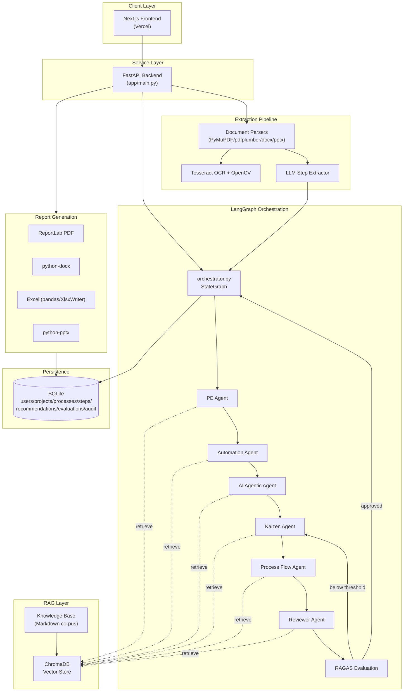

# Architecture

## System Overview

## Layers

1. **Client Layer** - the Next.js frontend (`process-diagnostic-frontend`,
   deployed to Vercel) that talks to the FastAPI backend.
2. **Service Layer** - the FastAPI REST API (`app/main.py`) exposing the
   pipeline to the frontend.
3. **Orchestration Layer** - a LangGraph `StateGraph` (`app/agents/orchestrator.py`)
   sequencing six ReAct agents, with a conditional edge that loops back to
   the Kaizen Agent when RAGAS scores fall below threshold.
4. **RAG Layer** - a Markdown knowledge base (`app/rag/knowledge_base/`)
   chunked and embedded into ChromaDB (`app/rag/vector_store.py`), queried
   via a shared `search_knowledge_base` LangChain tool every agent can call.
5. **Extraction Pipeline** - multi-format document parsing (PDF/DOCX/PPTX/
   image/BPMN/CSV/Excel) with OpenCV-assisted Tesseract OCR for scanned
   content, then an LLM structured-output pass that reconstructs the
   ordered process step list.
6. **Persistence** - SQLite via SQLAlchemy ORM (`app/database/models.py`):
   users, projects, processes, process_steps, recommendations,
   agent_responses, evaluation_scores, rag_history, uploads, feedback,
   audit_logs.
7. **Report Generation** - PDF (ReportLab), Word (python-docx), Excel
   (pandas/XlsxWriter), PowerPoint (python-pptx), all built from one shared
   `ReportContext` so every format stays consistent.

## Why LangGraph + ReAct (not a linear pipeline)

Each agent is built with LangGraph's `create_react_agent`, meaning it can
genuinely **reason, call a tool (RAG search or process-data lookup), observe
the result, and reason again** before producing its final answer - rather
than having all context force-fed into a single prompt. The orchestrator
graph then adds a second layer of agentic control: a **conditional edge**
that routes back to the Kaizen Agent for revision when the Reviewer
Agent's RAGAS evaluation falls below the configured quality threshold
(`RAGAS_MIN_SCORE`, default 0.70), up to `RAGAS_MAX_REVIEW_ROUNDS` rounds.

## Key Design Decisions

- **RAGAS scores the exact context each agent retrieved**, not a re-run
  retrieval - `app/agents/context_capture.py` records every chunk pulled by
  the `search_knowledge_base` tool during a ReAct loop via a `ContextVar`,
  so faithfulness/context metrics reflect what the agent actually reasoned over.
- **Deterministic savings math** - LLM agents estimate a recommendation's
  own savings with stated assumptions; `app/agents/savings_calculator.py`
  performs the actual roll-up arithmetic so the headline efficiency number
  is reproducible and auditable, not LLM-generated.
- **One shared `ReportContext`** feeds all four report formats so the PDF,
  Word, Excel, and PPT deliverables never drift out of sync with each other.
