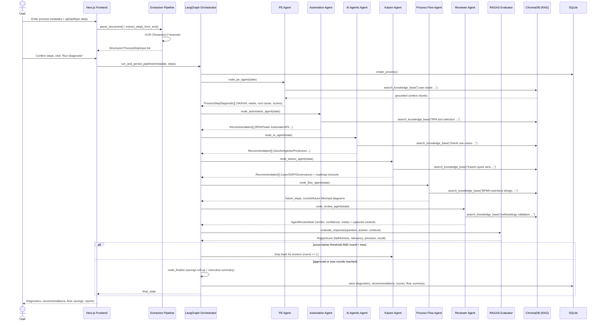

# Sequence Diagram: End-to-End Diagnostic Run

```mermaid
sequenceDiagram
    actor User
    participant UI as Next.js Frontend
    participant Extract as Extraction Pipeline
    participant Orch as LangGraph Orchestrator
    participant PE as PE Agent
    participant Auto as Automation Agent
    participant AI as AI Agentic Agent
    participant Kaizen as Kaizen Agent
    participant Flow as Process Flow Agent
    participant Rev as Reviewer Agent
    participant Ragas as RAGAS Evaluator
    participant Rag as ChromaDB (RAG)
    participant DB as SQLite

    User->>UI: Enter process metadata + upload/type steps
    UI->>Extract: parse_document() / extract_steps_from_text()
    Extract->>Extract: OCR (Tesseract) if scanned
    Extract-->>UI: Structured ProcessStepInput list
    User->>UI: Confirm steps, click "Run Diagnostic"

    UI->>Orch: run_and_persist_pipeline(metadata, steps)
    Orch->>DB: create_process()

    Orch->>PE: node_pe_agent(state)
    PE->>Rag: search_knowledge_base("Lean waste ...")
    Rag-->>PE: grounded context chunks
    PE-->>Orch: ProcessStepDiagnostic[] (VA/NVA, waste, root cause, scores)

    Orch->>Auto: node_automation_agent(state)
    Auto->>Rag: search_knowledge_base("RPA tool selection ...")
    Auto-->>Orch: Recommendation[] (RPA/Power Automate/API/...)

    Orch->>AI: node_ai_agent(state)
    AI->>Rag: search_knowledge_base("GenAI use cases ...")
    AI-->>Orch: Recommendation[] (GenAI/Agentic/Predictive/...)

    Orch->>Kaizen: node_kaizen_agent(state)
    Kaizen->>Rag: search_knowledge_base("Kaizen quick wins ...")
    Kaizen-->>Orch: Recommendation[] (Lean/SOP/Governance) + roadmap horizons

    Orch->>Flow: node_flow_agent(state)
    Flow->>Rag: search_knowledge_base("BPMN swimlane design ...")
    Flow-->>Orch: future_steps, current/future Mermaid diagrams

    Orch->>Rev: node_review_agent(state)
    Rev->>Rag: search_knowledge_base("methodology validation ...")
    Rev-->>Orch: AgentReviewNote (verdict, confidence, notes) + captured contexts

    Orch->>Ragas: evaluate_response(question, answer, contexts)
    Ragas-->>Orch: RagasScore (faithfulness, relevancy, precision, recall)

    alt score below threshold AND round < max
        Orch->>Kaizen: loop back for revision (round += 1)
    else approved or max rounds reached
        Orch->>Orch: node_finalize (savings roll-up + executive summary)
        Orch->>DB: save diagnostics, recommendations, scores, flow, summary
        Orch-->>UI: final_state
    end

    UI-->>User: Diagnostics, recommendations, flow, savings, reports
```
